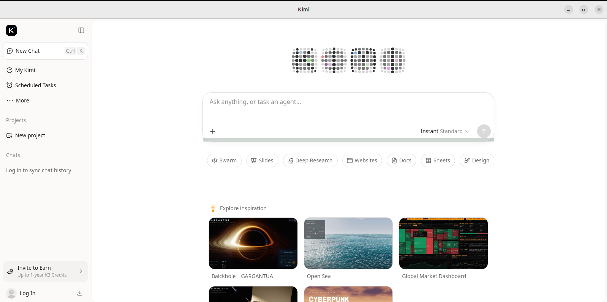

# Kimi Desktop for Linux

[](https://github.com/bigjoe420/kimi-desktop-linux/releases)

A minimal, native desktop wrapper for [Kimi](https://kimi.moonshot.cn) built with [Tauri v2](https://tauri.app).

---

## Motivation

The official Kimi Linux package is broken on modern Ubuntu LTS releases. It links against `libwebkit2gtk-4.0`, which was removed from Ubuntu 22.04+ and Debian 12+ repositories in favor of `libwebkit2gtk-4.1`. As a result, the official client fails to install or run on:

- Ubuntu 22.04 LTS / 24.04 LTS
- Debian 12 (Bookworm)
- Any distribution that no longer ships `libwebkit2gtk-4.0`

This wrapper solves the problem by building on Tauri v2, which links against `libwebkit2gtk-4.1` — the actively maintained WebKitGTK branch. The result is a single native binary with a system webview, no bundled Chromium, and full desktop integration, installable on current distributions with no workarounds.



---

## Disclaimer

Noad Laboratories is an independent entity and is not affiliated with, endorsed by, sponsored by, or otherwise connected to Moonshot AI. "Kimi" is a product of Moonshot AI; this project is an unofficial, community-built desktop wrapper and uses no Moonshot AI branding or assets. All trademarks belong to their respective owners.

---

## Features

- Native WebKit2GTK-4.1 webview
- Persistent window state (size/position remembered across sessions)
- Single-instance enforcement (relaunching focuses the existing window)
- External links open in the system browser
- `.deb` and AppImage bundles
- Minimal codebase, no framework bloat

---

## Installation

### Prebuilt packages (recommended)

Download the latest `.deb` or `.AppImage` from the [GitHub Releases](https://github.com/bigjoe420/kimi-desktop-linux/releases) page.

**Debian/Ubuntu (.deb):**

```bash
sudo apt install ./Kimi_0.1.0_amd64.deb
```

`apt` resolves the `libwebkit2gtk-4.1-0` dependency automatically. Launch Kimi from your application menu afterward.

**AppImage (portable):**

```bash
chmod +x Kimi_0.1.0_amd64.AppImage
./Kimi_0.1.0_amd64.AppImage
```

### Build from source

| Distro | Minimum Version |
|--------|----------------|
| Ubuntu | 22.04 LTS |
| Debian | 12 (Bookworm) |

```bash
git clone https://github.com/bigjoe420/kimi-desktop-linux.git
cd kimi-desktop-linux
chmod +x build.sh
./build.sh
```

The script will:

1. Install system dependencies via `apt`
2. Install Rust (if missing)
3. Install the Tauri v2 CLI (pinned to `2.11.4`)
4. Build release bundles

Output artifacts:

- `src-tauri/target/release/bundle/deb/*.deb`
- `src-tauri/target/release/bundle/appimage/*.AppImage`

### Manual build

If you prefer not to use the script:

```bash
# 1. Install dependencies
sudo apt-get update
sudo apt-get install -y build-essential curl wget libssl-dev libgtk-3-dev \
  libwebkit2gtk-4.1-dev libjavascriptcoregtk-4.1-dev \
  libayatana-appindicator3-dev librsvg2-dev patchelf pkg-config

# 2. Install Rust
curl --proto '=https' --tlsv1.2 -sSf https://sh.rustup.rs | sh
source $HOME/.cargo/env

# 3. Install Tauri CLI
cargo install tauri-cli --version "2.11.4" --locked

# 4. Build
cargo tauri build
```

---

## Project Structure

```
kimi-desktop-linux/
├── src/
│   └── index.html              # Splash loader shown while Kimi loads
├── src-tauri/
│   ├── Cargo.toml              # Rust dependencies
│   ├── tauri.conf.json         # App & window configuration
│   ├── build.rs                # Build script
│   ├── capabilities/
│   │   └── default.json        # Runtime permission manifest
│   ├── icons/                  # Noad Labs branding assets
│   └── src/
│       ├── main.rs             # Entry point
│       └── lib.rs              # App bootstrap
├── build.sh                    # One-command build script
└── README.md
```

---

## License

MIT — see [LICENSE](LICENSE).

---

*Maintained by Joe Kyser (Noad Laboratories)*
